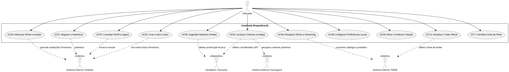
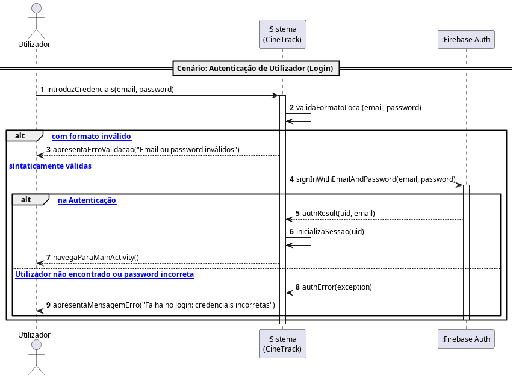

# Engenharia de Requisitos e Casos de Uso — CineTrack

## 1. Engenharia de Requisitos

A especificação de requisitos do **CineTrack** (*ProjectDroid*) estrutura-se em **11 Requisitos Funcionais (RF)** derivados das *Issues* do backlog e num conjunto estrito de **Requisitos Não-Funcionais (RNF)** que garantem conformidade com as boas práticas de desenvolvimento móvel e os critérios de avaliação de DSSMV.

### 1.1. Requisitos Funcionais (RF)

| ID | Designação | Issue | Descrição | Prioridade |
| :--- | :--- | :--- | :--- | :--- |
| **RF01** | Registar e Autenticar Utilizador | #1 | Permitir a criação de conta e início de sessão via email/password com Firebase Auth. | Must Have |
| **RF02** | Criar e Gerir Listas de Filmes | #2 | Permitir ao utilizador criar, consultar, editar e eliminar coleções personalizadas no Firestore. | Must Have |
| **RF03** | Adicionar Filmes e Submeter Avaliações | #3 | Permitir associar filmes a listas e registar classificações ($[1.0, 5.0]$ estrelas) com comentário. | Must Have |
| **RF04** | Pesquisa de Filmes e Provedores de Streaming | #4 | Pesquisar filmes via TMDB API e exibir os fornecedores de streaming em Portugal. | Must Have |
| **RF05** | Localizar Cinemas Próximos | #5 | Mapear salas de cinema num raio geográfico através do GPS e da Foursquare Places API. | Should Have |
| **RF06** | Sugestão Aleatória (*Shake to Suggest*) | #6 | Recomendar um filme aleatório da coleção do utilizador quando o dispositivo for agitado fisicamente. | Should Have |
| **RF07** | Gestão de Perfil e Logout | #7 | Consultar dados da conta e terminar sessão de forma segura. | Must Have |
| **RF08** | Guardar Preferências Locais | #8 | Persistir localmente o raio de pesquisa de cinemas e o país padrão em `SharedPreferences`. | Should Have |
| **RF09** | Filtragem e Ordenação da Coleção | #9 | Ordenar por título/nota e filtrar por estado de visualização na camada de domínio. | Should Have |
| **RF10** | Visualização de Trailers Oficiais | #10 | Abrir trailers do YouTube a partir dos metadados do TMDB via *Implicit Intent*. | Could Have |
| **RF11** | Partilha Externa de Filmes | #11 | Partilhar dados formatados de um filme para apps externas via `ACTION_SEND` e *Chooser*. | Could Have |

---

### 1.2. Requisitos Não-Funcionais (RNF)

* **RNF01 — Padrão Arquitetural MVC:** O sistema deve manter rigorosa segregação entre Model (entidades puras e validações), View (layouts declarativos em XML) e Controller (`Activities` gestoras de ciclo de vida).
* **RNF02 — Pureza e Versão do Java (Java 21):** O código da camada Model deve ser escrito exclusivamente em **Java 21 puro**, sem importações do Android SDK (`Context`, `View`, `Bundle`, etc.) e sem chamadas a `System.out` ou `System.in`.
* **RNF03 — Design Responsivo de Interface:** É estritamente proibida a utilização de píxeis absolutos (`px`) nos ficheiros XML da View. Devem ser usadas exclusivamente unidades **`dp`** para layout/margens e **`sp`** para tipografia.
* **RNF04 — Não-Bloqueio da UI Thread (Concorrência):** Operações de rede (Retrofit com `.enqueue()`), persistência no Firestore e cálculos intensivos devem ser assíncronas. Atualizações da interface originadas em tarefas de background devem recorrer a `Activity.runOnUiThread(Runnable)`.
* **RNF05 — Persistência Não-Bloqueante com `SharedPreferences`:** A escrita de dados locais leves deve ser realizada obrigatoriamente através de **`.apply()`** (assíncrono), sendo expressamente proibido o uso de `.commit()` (síncrono/bloqueante).
* **RNF06 — Robustez e Tolerância a Falhas:** Falhas na obtenção de sinal GPS, ausência de conectividade de rede ou entradas de formulário inválidas devem ser capturadas defensivamente e comunicadas ao utilizador sem encerramento anómalo da aplicação (*crash*).

---

## 2. Diagrama Global de Casos de Uso

O diagrama global de Casos de Uso espelha as interações do utilizador com o CineTrack e a comunicação orquestrada com serviços externos e sensores nativos do hardware.

Ficheiro PlantUML: [`docs/diagrams/use_cases.puml`](diagrams/use_cases.puml).

---

## 3. Especificação Detalhada do Caso de Uso — UC01: Registar e Autenticar Utilizador

### 3.1. Ficha do Caso de Uso

* **Identificador:** UC01 (Associado à **Issue #1**)
* **Nome:** Registar e Autenticar Utilizador
* **Atores Primários:** Utilizador Não Autenticado
* **Atores Secundários:** Firebase Authentication
* **Interessados e Interesses:**
  * **Utilizador:** Pretende criar uma conta pessoal ou iniciar sessão com as suas credenciais para aceder às suas listas privadas e avaliações.
  * **CineTrack:** Necessita de garantir que apenas utilizadores autenticados criam e alteram dados pessoais no Firestore.
* **Pré-condições:**
  * O dispositivo deve dispor de conectividade com a Internet.
* **Pós-condições:**
  * O utilizador obtém um token de sessão válido emitido pelo Firebase Auth e é encaminhado para a `MainActivity`.

### 3.2. Fluxo Principal de Eventos (Início de Sessão / Login)

1. O utilizador acede ao ecrã de Login (`LoginActivity`).
2. O sistema apresenta os campos de preenchimento de email e password e as ações de submissão.
3. O utilizador introduz o seu email e password e seleciona a opção "Entrar".
4. O sistema valida localmente a sintaxe dos dados introduzidos (email com formato válido e password não vazia com pelo menos 6 carateres).
5. O sistema submete o pedido de autenticação de forma assíncrona ao Firebase Authentication (`signInWithEmailAndPassword`).
6. O Firebase Authentication valida as credenciais e devolve confirmação de sucesso juntamente com o UID do utilizador.
7. O sistema guarda o estado da sessão e navega via *Explicit Intent* para a `MainActivity`, limpando a pilha de atividades (`FLAG_ACTIVITY_NEW_TASK | FLAG_ACTIVITY_CLEAR_TASK`).

### 3.3. Fluxos Alternativos e Exceções

* **FA1 — Criação de Nova Conta (Registo):**
  1. No passo 3, o utilizador seleciona "Criar Nova Conta" em vez de entrar.
  2. O sistema navega para a `RegisterActivity`.
  3. O utilizador introduz nome, email e password (com confirmação de password).
  4. O sistema valida os campos e solicita o registo assíncrono ao Firebase Auth (`createUserWithEmailAndPassword`).
  5. Após confirmação do Firebase, o sistema cria o perfil inicial no Firestore e redireciona para a `MainActivity`.

* **E1 — Credenciais Sintaticamente Inválidas:**
  * No passo 4, se o email não contiver formato válido ou a password tiver menos de 6 caracteres, o sistema não efetua chamada de rede e apresenta uma mensagem de erro no ecrã (`setError` no `TextInputLayout` ou `Snackbar`).

* **E2 — Falha de Autenticação Remota (Firebase):**
  * No passo 6, se o Firebase devolver erro (ex.: utilizador inexistente ou password incorreta), o sistema apresenta uma notificação ao utilizador informando a causa da falha e mantém o ecrã de login aberto para nova tentativa.

### 3.4. Diagrama de Sequência de Sistema (SSD — UC01)

Ficheiro PlantUML: [`docs/diagrams/ssd_uc01_auth.puml`](diagrams/ssd_uc01_auth.puml).

