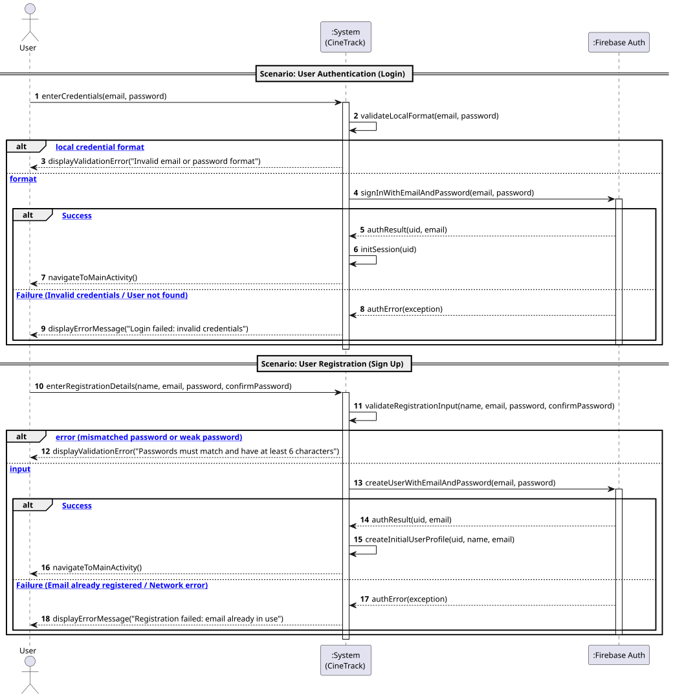

# US1: [Epic: Auth] Registar e Autenticar Utilizador (Firebase)

## 1. Descrição do Caso de Uso / User Story
Como um utilizador do CineTrack, pretendo criar uma nova conta e autenticar-me na aplicação utilizando o meu endereço de email e palavra-passe, para que possa aceder ao meu catálogo pessoal, gerir as minhas listas de filmes e submeter avaliações no Cloud Firestore de forma segura.

---

## 2. Critérios de Aceitação (Acceptance Criteria)
* **AC01 — Validação Sintática Local:** O endereço de email tem de ter um formato válido (`user@domain.ext`) e a palavra-passe deve ter pelo menos 6 carateres. Campos vazios não disparam chamadas de rede e apresentam mensagens de erro claras na interface.
* **AC02 — Autenticação Firebase (Login):** Utilizadores previamente registados devem conseguir autenticar-se através de `signInWithEmailAndPassword` de forma assíncrona.
* **AC03 — Criação de Conta (Registo):** Novos utilizadores devem conseguir registar-se através de `createUserWithEmailAndPassword`, verificando confirmação de palavra-passe idêntica.
* **AC04 — Redirecionamento e Gestão de Pilha:** Após autenticação com sucesso, a aplicação deve transitar para a `MainActivity`, limpando a pilha de atividades (`FLAG_ACTIVITY_NEW_TASK | FLAG_ACTIVITY_CLEAR_TASK`) para evitar que o botão de retrocesso do Android reabra o ecrã de login.
* **AC05 — Design Responsivo:** Ecrãs XML concebidos estritamente em **`dp`** (margens e dimensões) e **`sp`** (tipografia), com total ausência de píxeis absolutos (`px`).
* **AC06 — UI Thread Desimpedida:** Nenhuma operação de rede com o Firebase pode bloquear a *UI Thread*.

---

## 3. Pré-condições e Pós-condições
* **Pré-condições:** O dispositivo móvel deve ter ligação ativa à Internet.
* **Pós-condições:** O utilizador passa a ter uma sessão ativa gerida pelo Firebase Auth, sendo instanciado o objeto de domínio `User` em memória.

---

## 4. Fluxo Principal de Eventos (Início de Sessão)
1. O utilizador acede ao ecrã de login (`LoginActivity`).
2. O sistema apresenta os campos de email e palavra-passe.
3. O utilizador insere as credenciais e pressiona "Login".
4. O sistema valida os campos localmente.
5. O sistema invoca assincronamente `FirebaseAuth.signInWithEmailAndPassword(...)`.
6. O Firebase confirma as credenciais e devolve o UID do utilizador.
7. O sistema inicializa a sessão e navega para a `MainActivity`, limpando a pilha de atividades.

---

## 5. Fluxos Alternativos e Exceções

* **FA1 — Criação de Nova Conta (Sign Up):**
  1. No passo 3, o utilizador clica em "Criar Nova Conta".
  2. O sistema navega para a `RegisterActivity`.
  3. O utilizador preenche nome, email, password e confirmação de password.
  4. O sistema valida a correspondência das passwords e tamanho mínimo.
  5. O sistema invoca `FirebaseAuth.createUserWithEmailAndPassword(...)`.
  6. Em caso de sucesso, o perfil é inicializado e o utilizador é encaminhado para a `MainActivity`.

* **E1 — Credenciais Inválidas ou Inexistentes:**
  * O Firebase devolve `FirebaseAuthInvalidCredentialsException` ou `FirebaseAuthInvalidUserException`.
  * O sistema exibe um `Snackbar`/`Toast` informativo e mantém os campos para nova tentativa.

* **E2 — Email Já Registado:**
  * O Firebase devolve `FirebaseAuthUserCollisionException`.
  * O sistema informa o utilizador que o endereço já se encontra associado a uma conta.

---

## 6. Diagrama de Sequência de Sistema (SSD)

Ficheiro PlantUML fonte: [`puml/ssd_us1_auth.puml`](puml/ssd_us1_auth.puml)

---

## 7. Mapeamento Arquitetural (MVC)
* **Model:** Entidade pura [`User.java`](../../../src/main/java/pt/isep/dssmv/projectdroid/model/User.java) e exceção [`InvalidDataException.java`](../../../src/main/java/pt/isep/dssmv/projectdroid/exceptions/InvalidDataException.java).
* **View:** `res/layout/activity_login.xml` e `res/layout/activity_register.xml`.
* **Controller:** `LoginActivity.java` e `RegisterActivity.java`.
