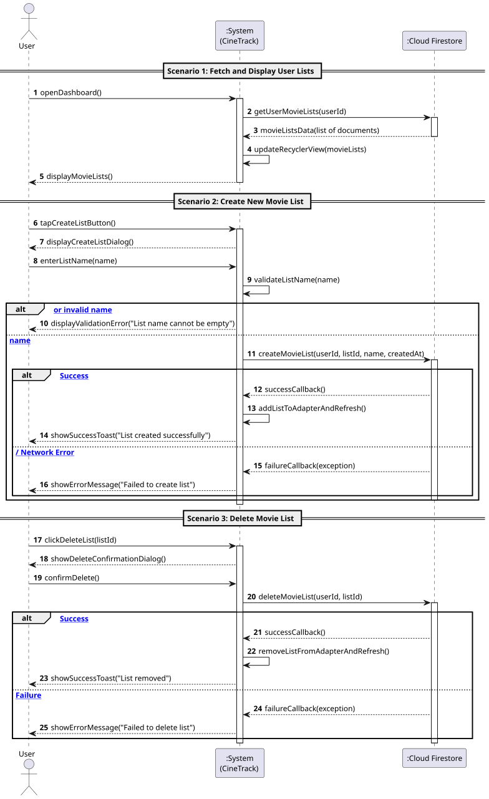

# US2: [Epic: CRUD] Criar e Gerir Listas de Filmes (Cloud Firestore)

## 1. Descrição do Caso de Uso / User Story
Como um utilizador autenticado no CineTrack, pretendo criar, visualizar e eliminar coleções personalizadas de filmes (ex.: "Favoritos", "Para Ver Mais Tarde", "Clássicos de Ficção Científica"), para que possa manter os meus filmes organizados de forma persistente e sincronizada em tempo real através do Cloud Firestore.

---

## 2. Critérios de Aceitação (Acceptance Criteria)
* **AC01 — Validação na Camada de Domínio:** A criação de uma lista recorre à entidade pura [`MovieList.java`](../../../src/main/java/pt/isep/dssmv/projectdroid/model/MovieList.java). Se o nome da lista for nulo ou vazio, é obrigatoriamente lançada a exceção checada `InvalidDataException`, impedindo chamadas à base de dados.
* **AC02 — Criação de Nova Lista (Create):** O utilizador pode acionar um diálogo modal na `MainActivity`, preencher o nome da coleção e gravá-la assincronamente no Cloud Firestore.
* **AC03 — Listagem em Tempo Real / Assíncrona (Read):** As listas pertencentes ao utilizador autenticado (`users/{userId}/lists`) são carregadas e apresentadas visualmente através de um `RecyclerView` e de um adapter customizado (`MovieListAdapter`).
* **AC04 — Remoção de Lista (Delete):** Cada item da lista disponibiliza uma opção de eliminação com pedido de confirmação prévia, removendo o respetivo documento do Cloud Firestore e atualizando o `RecyclerView`.
* **AC05 — Feedback e Estado Vazio (Empty State):** Caso o utilizador não possua nenhuma lista criada, a interface deve exibir uma mensagem indicativa encorajando a criação da primeira coleção.
* **AC06 — UI Thread Desimpedida:** Todas as operações de leitura e escrita no Cloud Firestore devem ser estritamente assíncronas, nunca bloqueando a interface.

---

## 3. Pré-condições e Pós-condições
* **Pré-condições:** O utilizador deve ter sessão autenticada ativa no Firebase Authentication e ligação à Internet.
* **Pós-condições:** As coleções personalizadas são persistidas na coleção `users/{userId}/lists` do Cloud Firestore.

---

## 4. Fluxo Principal de Eventos
1. O utilizador acede ao ecrã principal (`MainActivity`).
2. O sistema consulta assincronamente o Firestore pelas listas associadas ao `userId` autenticado.
3. O Firestore devolve a coleção de documentos e o sistema renderiza as listas no `RecyclerView`.
4. O utilizador clica no botão "Criar Lista".
5. O sistema apresenta o diálogo para inserção do nome da coleção.
6. O utilizador introduz o nome e confirma.
7. O sistema valida os dados com a entidade `MovieList` e submete o novo documento para o Cloud Firestore.
8. Após confirmação remota, a nova lista é adicionada ao adapter e apresentada no ecrã com feedback visual (*Toast*).

---

## 5. Fluxos Alternativos e Exceções
* **FA1 — Eliminação de Lista:**
  1. No passo 3, o utilizador clica no ícone de eliminação de uma lista.
  2. O sistema exibe um diálogo de confirmação: *"Tem a certeza de que deseja eliminar esta lista?"*.
  3. O utilizador confirma e o documento é removido assincronamente do Firestore.
  4. O item é removido do adapter com notificação de atualização da View.
* **E1 — Nome de Lista Inválido / Vazio:**
  * No passo 6, se o nome estiver em branco, o sistema não efetua chamada de rede e apresenta aviso no campo de texto.
* **E2 — Falha de Conexão com o Firestore:**
  * O Firestore devolve erro de rede ou permissão. O sistema apresenta mensagem de erro sem terminar a aplicação.

---

## 6. Diagrama de Sequência de Sistema (SSD)

Ficheiro PlantUML fonte: [`puml/ssd_us2_manage_lists.puml`](puml/ssd_us2_manage_lists.puml)

---

## 7. Mapeamento Arquitetural (MVC)
* **Model:** [`MovieList.java`](../../../src/main/java/pt/isep/dssmv/projectdroid/model/MovieList.java) e [`InvalidDataException.java`](../../../src/main/java/pt/isep/dssmv/projectdroid/exceptions/InvalidDataException.java).
* **View:** `res/layout/item_movie_list.xml`, `activity_main.xml` e diálogo `dialog_create_list.xml` em `dp`/`sp`.
* **Adapter:** `MovieListAdapter.java` no pacote `pt.isep.dssmv.projectdroid.adapters`.
* **Backend:** `FirestoreManager.java` no pacote `pt.isep.dssmv.projectdroid.firebase`.
* **Controller:** `MainActivity.java` no pacote `pt.isep.dssmv.projectdroid.controllers`.
