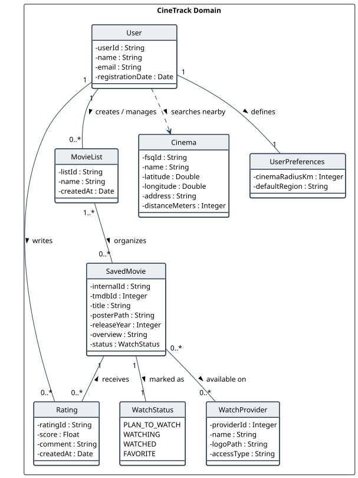
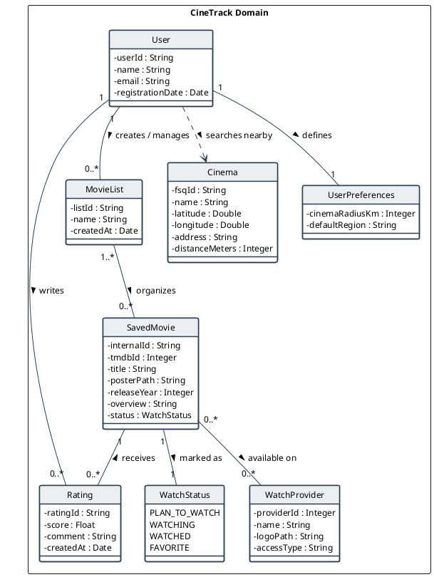

# Domain Model — CineTrack

## 1. Introduction and Conceptual Scope

The **Domain Model** represents the real-world conceptual entities and their relationships within the **CineTrack** (*ProjectDroid*) system. It acts as the invariant foundation of the application, defining data semantics, constraints, and business rules before any Android platform dependencies are introduced.

In strict adherence to the **Model-View-Controller (MVC)** architectural pattern and DSSMV course guidelines:
* All classes derived from this model reside in `pt.isep.dssmv.projectdroid.model`.
* Implementation uses **pure native Java 21**, fully decoupled from the Android SDK (no imports of `Context`, `View`, `Bundle`, `Activity`, etc.).
* Code naming conventions, entities, fields, methods, and exceptions are entirely in **English**.
* Any violation of domain rules throws **custom checked exceptions** (`extends Exception`) in `pt.isep.dssmv.projectdroid.exceptions`.
* The use of `System.out` or `System.in` in domain classes is **strictly prohibited**.
* Code is clean, idiomatic, simple, and avoids artificial boilerplate or unnecessary complexity.

---

## 2. Domain Model Diagram (PlantUML)

The domain diagram is modeled in PlantUML and versioned in [`puml/domain_model.puml`](puml/domain_model.puml).

---

## 3. Entity Specification and Invariants

### 3.1. `User`
* **Purpose:** Represents an authenticated user (managed remotely via Firebase Auth).
* **Attributes:**
  * `userId : String` — Unique identifier (Firebase UID). Mandatory and non-blank.
  * `name : String` — Display name. Mandatory (minimum 2 characters).
  * `email : String` — Validated email address format (`user@domain.ext`).
  * `registrationDate : Date` — Account creation timestamp.
* **Invariants:**
  * Cannot create a user without a non-empty `userId` or valid `email`.
  * Throws `InvalidDataException` on rule violation.

### 3.2. `MovieList`
* **Purpose:** Custom collection created by a user to organize movies (e.g., "Favorites", "Watchlist", "Top Sci-Fi").
* **Attributes:**
  * `listId : String` — Unique identifier (UUID or Firestore document ID).
  * `name : String` — List title (between 1 and 60 characters).
  * `createdAt : Date` — List creation timestamp.
* **Invariants:**
  * Name cannot be null or empty.
  * Throws `InvalidDataException` on violation.

### 3.3. `SavedMovie`
* **Purpose:** Movie instance saved in user lists, synchronized with TMDB metadata.
* **Attributes:**
  * `internalId : String` — Internal identifier for persistence.
  * `tmdbId : Integer` — Official TMDB external movie ID (positive integer).
  * `title : String` — Movie title.
  * `posterPath : String` — Image path for the movie poster.
  * `releaseYear : Integer` — Release year ($\ge 1888$).
  * `overview : String` — Synopsis/description.
  * `status : WatchStatus` — User viewing status (`PLAN_TO_WATCH`, `WATCHING`, `WATCHED`, `FAVORITE`).
* **Invariants:**
  * `tmdbId` must be greater than 0.
  * `title` cannot be null or empty.

### 3.4. `Rating`
* **Purpose:** User review and numeric score for a saved movie.
* **Attributes:**
  * `ratingId : String` — Unique review ID.
  * `score : Float` — Quantitative score strictly in $[1.0, 5.0]$.
  * `comment : String` — Review text (optional, up to 500 characters).
  * `createdAt : Date` — Submission timestamp.
* **Invariants:**
  * If $\text{score} < 1.0$ or $\text{score} > 5.0$, throws `InvalidRatingException`.

### 3.5. `WatchProvider`
* **Purpose:** Digital streaming platform available for a title in Portugal (TMDB `/watch/providers`).
* **Attributes:**
  * `providerId : Integer` — TMDB provider ID (e.g., Netflix = 8, HBO Max = 384).
  * `name : String` — Platform commercial name.
  * `logoPath : String` — Logo image path.
  * `accessType : String` — Access method (*flatrate* / subscription, rent, buy).

### 3.6. `Cinema`
* **Purpose:** Geographic Point of Interest (POI) near the user (retrieved via Foursquare Places API and GPS).
* **Attributes:**
  * `fsqId : String` — Foursquare place ID.
  * `name : String` — Cinema venue name.
  * `latitude : Double`, `longitude : Double` — WGS84 coordinates.
  * `address : String` — Street address.
  * `distanceMeters : Integer` — Distance from current user GPS position.

### 3.7. `UserPreferences`
* **Purpose:** Local lightweight settings persisted via `SharedPreferences`.
* **Attributes:**
  * `cinemaRadiusKm : Integer` — Search radius (e.g., 5 km, 10 km).
  * `defaultRegion : String` — ISO region code (default: "PT").
* **Persistence Constraint:**
  * Write operations must always invoke `.apply()` (asynchronous), never `.commit()`.

---

## 4. Traceability Matrix (Domain $\leftrightarrow$ Backlog Issues)

| Entity / Concept | Associated Issue(s) | Description |
| :--- | :--- | :--- |
| `User` | **Issue #1, Issue #7** | Firebase Authentication, Register, Profile, Logout. |
| `MovieList` | **Issue #2** | List creation, management, Firestore sync. |
| `SavedMovie` | **Issue #3, Issue #6, Issue #9** | Adding movies, Shake to Suggest, sorting/filtering. |
| `Rating` | **Issue #3** | Score $[1.0, 5.0]$ submission and average computation. |
| `WatchProvider` | **Issue #4** | TMDB API search and streaming providers display. |
| `Cinema` | **Issue #5** | Geo-mapping cinemas using GPS and Foursquare API. |
| `UserPreferences` | **Issue #8** | Local storage using `SharedPreferences` (`.apply()`). |
