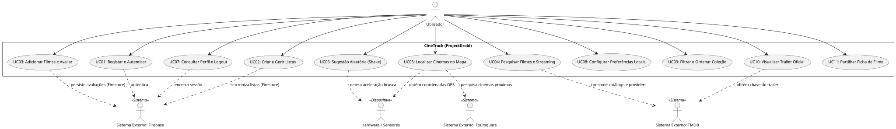
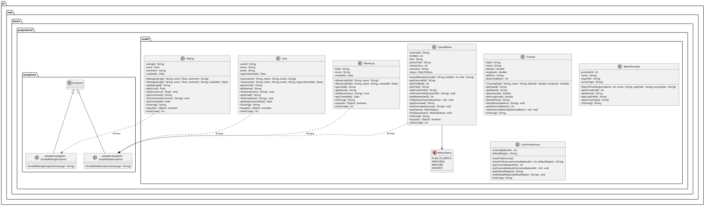
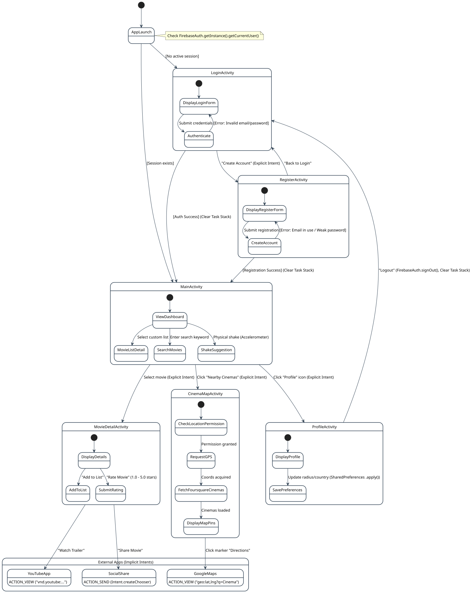

# CineTrack: Gestor Móvel de Filmes e Mapeamento Geoespacial de Cinemas

**André Silva (1240567)**, **Afonso Ferreira (1241013)**  
*Licenciatura em Engenharia de Telecomunicações e Informática (LETI)*  
*Instituto Superior de Engenharia do Porto (ISEP), Porto, Portugal*  
`{1240567, 1241013}@isep.ipp.pt`

---

## Resumo (Abstract)
O ecossistema de dispositivos móveis exige aplicações eficientes, reativas e com forte respeito pelos recursos limitados do hardware, tais como a autonomia da bateria e o tempo de resposta da interface gráfica (*UI Thread*). Este relatório descreve a conceção, arquitetura e implementação da aplicação Android nativa **CineTrack** (*ProjectDroid*), desenvolvida no âmbito da unidade curricular de Desenvolvimento de Software e Sistemas Móveis (DSSMV). O sistema permite a gestão de catálogos cinematográficos personalizados, integração com serviços REST externos (*The Movie Database* e *Foursquare Places API*), persistência remota no Firebase (Authentication e Firestore), bem como o aproveitamento de sensores nativos (GPS e acelerómetro para a funcionalidade *Shake to Suggest*). O desenvolvimento adota uma abordagem estrita orientada a especificações (*Documentation-First*), com implementação em Java 21 nativo puro na camada de Domínio, arquitetura Model-View-Controller (MVC) e conformidade total com as boas práticas de programação móvel.

**Palavras-chave:** Android, Java 21, Arquitetura MVC, Firebase, Retrofit, Sensores Móveis, TMDB, Foursquare, DSSMV.

---

## 1. Introdução e Âmbito

A proliferação de plataformas de distribuição de conteúdos em streaming originou uma fragmentação significativa na experiência do utilizador que procura obras cinematográficas e informação sobre salas de cinema locais. O projeto **CineTrack** visa responder a este desafio através de uma solução móvel consolidada e fluida.

Do ponto de vista pedagógico e de engenharia de software, o CineTrack corporiza os princípios fundamentais da programação para sistemas móveis:
1. **Separação de Responsabilidades:** Utilização do padrão arquitetural Model-View-Controller (MVC), garantindo a pureza do Modelo e o isolamento das regras de negócio.
2. **Respeito pela UI Thread:** Execução assíncrona mandatória para operações de rede, persistência e sensores, prevenindo o bloqueio da interface gráfica e mensagens do tipo *Application Not Responding* (ANR).
3. **Design Adaptativo e Responsivo:** Construção de interfaces gráficas em XML estritamente baseadas em unidades independentes de densidade (`dp`) e escala (`sp`).
4. **Integração de Sensores e Serviços REST:** Combinação de serviços externos na nuvem (Firebase Auth, Cloud Firestore, TMDB, Foursquare) com capacidades nativas do dispositivo (GPS e Acelerómetro).

---

## 2. Engenharia de Requisitos

A especificação funcional foi alinhada com as 11 *Issues* operacionais definidas para o projeto, complementada por requisitos não-funcionais eliminatórios.

### 2.1. Requisitos Funcionais (RF)
* **RF01 — Registar e Autenticar Utilizador (Issue #1):** O sistema deve autenticar e registar utilizadores através de credenciais de email e palavra-passe via Firebase Authentication.
* **RF02 — Criar e Gerir Listas de Filmes (Issue #2):** O utilizador deve poder criar, consultar e remover coleções personalizadas no Cloud Firestore.
* **RF03 — Adicionar Filmes e Submeter Avaliações (Issue #3):** Deve ser possível associar instâncias de filmes a listas e submeter notas de 1.0 a 5.0 estrelas com comentário descritivo.
* **RF04 — Pesquisa de Filmes e Provedores de Streaming (Issue #4):** O sistema deve consultar o catálogo do TMDB e listar as plataformas de streaming ativas em Portugal para cada filme.
* **RF05 — Localizar Cinemas Próximos (Issue #5):** Mapeamento dinâmico de cinemas em redor com base nas coordenadas GPS obtidas pelo dispositivo e na Foursquare Places API.
* **RF06 — Sugestão Aleatória ao Agitar o Dispositivo (Issue #6):** Recomendação instantânea de um filme do catálogo mediante deteção de movimento brusco via acelerómetro nativo (*Shake to Suggest*).
* **RF07 — Gestão de Perfil e Terminar Sessão (Issue #7):** Exibição de dados do utilizador autenticado e encerramento seguro de sessão no Firebase.
* **RF08 — Guardar Preferências Locais (Issue #8):** Gravação permanente de definições leves (raio de busca de cinemas e país padrão) via `SharedPreferences` assíncrono com `.apply()`.
* **RF09 — Filtragem e Ordenação da Coleção (Issue #9):** Ordenação alfabética, por nota e filtragem por estado de visualização na camada de domínio.
* **RF10 — Visualização de Trailers Oficiais (Issue #10):** Abertura de trailers oficiais do YouTube utilizando *Implicit Intent* com fallback defensivo.
* **RF11 — Partilha Externa de Fichas de Filmes (Issue #11):** Partilha formatada de resumos de filmes para redes e mensageiros através de `Intent.ACTION_SEND` e `Intent.createChooser()`.

### 2.2. Requisitos Não-Funcionais (RNF)
* **RNF01 (Arquitetura):** Aplicação estrita do padrão MVC, segregando `model/`, `controllers/`, `network/`, `firebase/`, `adapters/`, `exceptions/` e `utils/`.
* **RNF02 (Pureza do Modelo & Java 21):** O pacote `model` utiliza exclusivamente classes Java 21 nativas, sem `System.out`/`in`, sem referências ao Android SDK e com exceções checadas personalizadas (`extends Exception`).
* **RNF03 (Interface Gráfica):** Interdição formal de dimensões em píxeis absolutos (`px`), aplicando exclusivamente `dp` para métricas espaciais e `sp` para elementos de texto.
* **RNF04 (Concorrência e Assincronismo):** Proibição de operações síncronas bloqueantes na *UI Thread*. Retrofit opera unicamente com `.enqueue(Callback<T>)`.
* **RNF05 (Persistência Leve):** A persistência local em `SharedPreferences` usa imperativamente `.apply()`, rejeitando terminantemente `.commit()`.

---

## 3. Análise e Design de Software

### 3.1. Modelo de Domínio (Domain Model)
O Modelo de Domínio define as entidades conceptuais nucleares do sistema e a sua semântica antes de qualquer dependência tecnológica:

*(Ver documentação detalhada e invariantes em [`domain_model.md`](domain_model.md) e Glossário em [`glossary.md`](glossary.md)).*

### 3.2. Diagrama Global de Casos de Uso (UCD)
O diagrama reflete a interação do ator principal (*Utilizador*) com as funcionalidades do CineTrack e as ligações com os serviços externos:

*(Ver fichas completas e SSDs na pasta [`../Use Cases/`](../Use%20Cases/) e requisitos em [`requirements.md`](requirements.md)).*

### 3.3. Diagrama de Classes de Implementação (Model Layer)
Estrutura detalhada do pacote `pt.isep.dssmv.projectdroid.model` e exceções checadas:

### 3.4. Fluxo de Navegação e Interface (UI Flow Diagram)
Mapeamento dos ecrãs da aplicação, transições de estado e disparo de Intents explícitos e implícitos:

### 3.5. Diagrama de Sequência de Sistema (SSD — US1)
Demonstração da interação do utilizador durante o fluxo de autenticação e comunicação assíncrona com o Firebase Auth:

---

## 4. Decisões de Engenharia e Tecnologias

1. **Java 21 Nativo Puro no Domínio:** Garante portabilidade, testabilidade unitária sem recurso a mocks pesados de Android e desacoplamento total da lógica de negócio.
2. **Firebase Auth & Cloud Firestore:** Permitem autenticação robusta e base de dados documental em tempo real, sem necessidade de infraestrutura de backend proprietária.
3. **Retrofit 2 com Gson:** Abstração de chamadas REST assíncronas com tratamento tipado de respostas JSON.
4. **Foursquare Places API:** Pesquisa geoespacial de salas de cinema que dispensa a obrigatoriedade de cartão de crédito para developers, ao contrário da Google Places API.
5. **Acelerómetro com Gestão do Ciclo de Vida:** O registo do listener do sensor em `onResume()` e respetiva desativação em `onPause()` protege a integridade da bateria do dispositivo móvel.

---

## 5. Referências Bibliográficas

1. Horstmann, C. S.: *Big Java: Early Objects*, 6th Edition. Wiley (2015).
2. Android Developers Documentation: *Processes and Application Lifecycle*. [developer.android.com](https://developer.android.com).
3. TMDB API Documentation: *The Movie Database REST API v3*. [developer.themoviedb.org](https://developer.themoviedb.org).
4. Foursquare Places API: *Places API Documentation*. [location.foursquare.com](https://location.foursquare.com).
